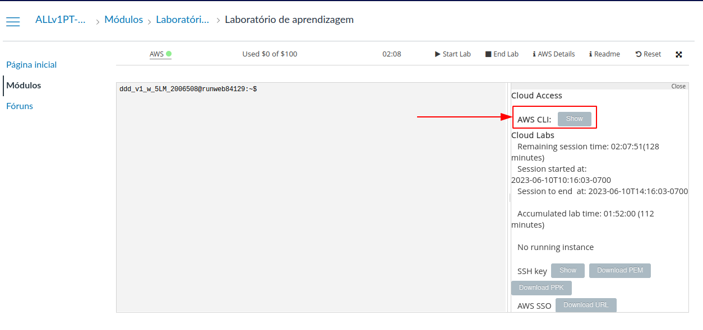

# RoadTracker

This is a system of vehicle monitoring.

To run, follow the instructions below:

# IN LOCAL HOST - BATCH VERSION

## Produce data (mock/mockCsv.py)
To produce data, run 
```
python3 mock/mockCsv.py
```

This will write data in the file *all_roads.csv()*.

## Process data (etl/BatchAnalysis.py)
To process data, run
```
python3 etl/BatchAnalysis.py
```
This will process data and send the results in a .parquet() file into *results* folder.

## Visualizing data (dash/app.py)
To visualize data, run
```
python3 dash/app.py
```
This will create a server and show a dashboard into your *localhost:8050*. The information in this dashboard is update
every 500ms.


# IN AWS

## Setup the Enviroment

### 1. Apache Kafka enviroment:

Ensure that you have Java installed locally (Kafka uses Java). Then:

1. Install the binary release of Kafka [here](https://kafka.apache.org/downloads) and extract with the following commands:
    ``tar -xzf kafka_<VERSION>.tgz ``
    ``cd kafka_<VERSION> ``

2. Start the Kafka enviroment. For this, you need to
   - Start the ZooKeeper Service:
   ```bin/zookeeper-server-start.sh config/zookeeper.properties```. It's like a "backend" for Kafka Broker.
    
   - In another terminal, start the Kafka Broker Service:
   ```bin/kafka-server-start.sh config/server.properties```

3. Now, you need to create the topic "sensor-data", where the applications are going to write/read events. For this, execute:
```bin/kafka-topics.sh --create --topic sensor-data --bootstrap-server localhost:9092```

> Obs: the local boostrap-server "localhost:9092" is the default server and port of Kafka configurations.


#### Testing the Kafka enviroment 
You can test if the local Kafka enviroment is working executing a local consumer and a local producer. For this, you need to:
1. Open a terminal that is your producer
```bin/kafka-console-producer.sh --topic sensor-data --bootstrap-server localhost:9092```

2. Open a terminal that is your consumer
   ```bin/kafka-console-consumer.sh --topic sensor-data --from-beginning --bootstrap-server localhost:9092```

Now, you can write messages in the producer console and see if the consumer console is receiving it.

### 2. AWS Academy Enviroment

For this project, we are going to use the [AWS Academy](https://awsacademy.instructure.com) platform. You need to login,
go to Courses > Modules > Learner Lab. Then, you need to click on "Start Lab" and wait to start your AWS navigation.

#### Getting and setting your AWS Credentials

First of all, you need to setup your AWS Credentials. For this, you also need to [install AWS CLI](https://docs.aws.amazon.com/pt_br/cli/latest/userguide/getting-started-install.html).
Then, on the AWS Academy page, click on "AWS Details". You will get your credentials for AWS CLI.

> These credentials are private, don't share them!

After getting your credentials, you need go to the folder where you install AWS CLI and copy and paste the credentials
into ```~/.aws/credentials```. But before, for this specific project, you need to change the ```default``` header for ```computacao-escalavel```.
Your credentials will be something like

    ```
    [computacao-escalavel]
    aws_access_key_id=<ACCESS_KEY_ID>
    aws_secret_access_key=<SECRET_ACCESS_KEY>
    aws_session_token=<AWS_SECTION_TOKEN>
    ```

#### Configure the AWS S3 Bucket
The next step is to configure the bucket where we're going to save our batches from further processing of ETL.
You can go back to AWS Academy console e click on the green circle beside "AWS".


After that, you're effectively in the AWS console. Now, search for "S3" in the search bar and click on the service.
After that, click on "Create bucket". On the creation page, give the name "**roadtracker**" for the bucket and then click 
on "Create Bucket" at the end of the page.

Now, you're ready to run the project.
